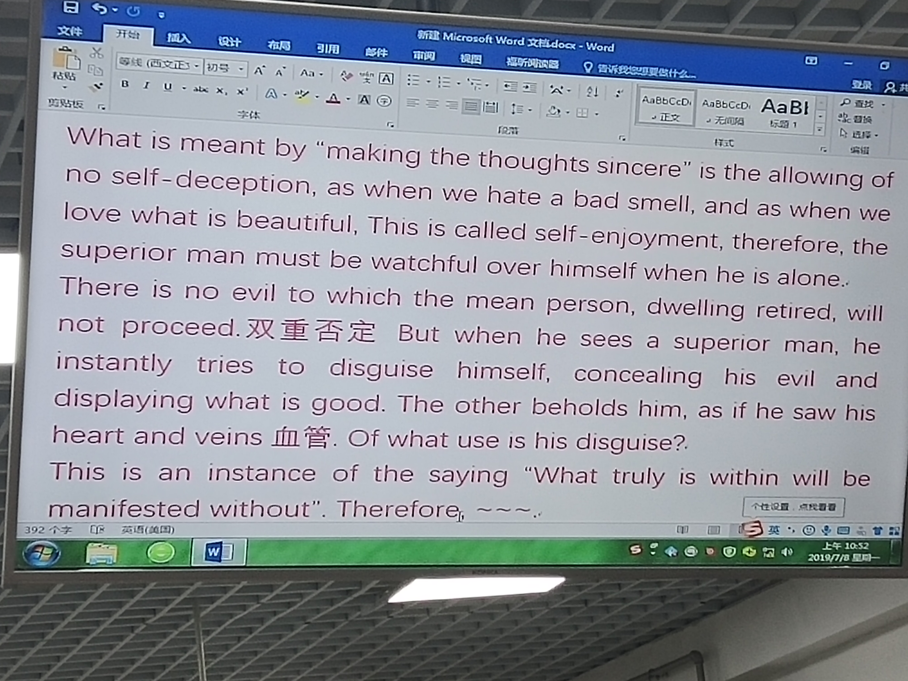

# 所谓诚其意者，毋自欺也。如恶恶臭，如好好色，此之谓自谦。故君子必慎其独也。 小人闲居为不善，无所不至。见君子而后厌然，揜其不善，而著其善。人之视己，如见其肺肝然，则何益矣。此谓诚于中，形于外。故君子必慎独也。 曾子曰，十目所视，十手所指，其严乎。 富润屋，德润身。心广，体胖。故君子必诚其意。

# What is meant by "making the thoughts sencere" is the allowing of no self-deception ,as when we hate a bad smell, and as when we love what is beautiful.This is called self-enjoyment, therefore, the superior man must be watchful  over himself when he is alone.There is no evil to which the mean person, dwelling retired, will not proceed.But when he sees a superior man , he instantly tries to disguise himself, concerning his evil and displaying what is good .The other beholds him, as if he saw his heart and venis .Of what use is his disguise? This is an insane of the saying "What truly is within will be manifested without".Therefore, the sincere man must make the thoughts sencere.
